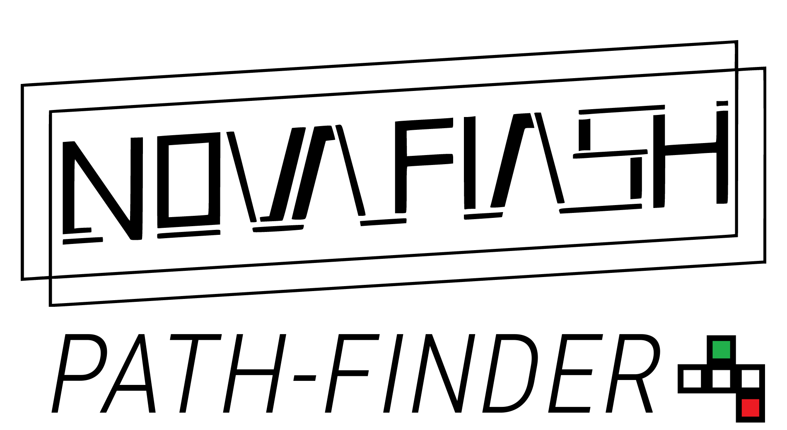

# Nova Flash's PathFinder

# Purpose
The purpose of this script is to create a randomly generated dungeon that utilizes tilesets created by the level designers. This script aims to allow modularity in terms of design and control for the user that uses the script. Currently, it is private, and no person is allowed to use it in their game. As of June 5, 2022, this script is only to be used for The Nova Experiment

# Design
Currently, the first iteration of the working script is on this repository, as of June 5, 2022. The goal from here on out is to optimize the code to allow a smoother performance at runtime. The initialization of the level is still fast, but it can be worked on. The use of this repository will mark the history of optimizations.

# The Name
The name PathFinder is a reference to DnD Pathfinder, a tabletop RPG game that use tiles for measurement. I thought this would be an homage of sorts :)

# Why create your own generator script?
I was rummaging through tutorials, and found no true method to generate dungeons purely for tileset. This excludes methods such as binary space partitioning, which generates an entire level solely off of recursion and loose tiles, but not tilesets, nor tiled rooms. This elmiminates that issue to allow for scalability for room size, or the amount of rooms the user wants to generate at runtime.

# How this script works
This script depends on a level designer to create tileset rooms of all equal sizes. For example, each tileset has to be square, and has to be the same size on the X and Z axis. The Y axis does not matter for this context, which allows designers to give depth for the levels in a 3D environment. Once the generator is in the scene, the tiles are dropped into the script to be instantiated at runtime.
1. The designer sets the amount of rooms the main path will generate. The next slider then sets how many branching rooms each origin room has. 
2. The script runs at runtime, and generates the level before the game starts. This allows for AI navmesh to bake (in theory) to the level.
3. As the generator is tile-based, the script only needs to check in 4 cardinal directions, North, East, South, and West. It checks if a room is at that location. If not, it is added to a list of directions for a potential spawn. That is then created into a Vector3 location for the environment, ignoring the Y-axis as it will all sit on the same Y-axis plane. The process repeats, generating the main path. The branching paths work the same way.
4. The rooms have their own script, which rotate the tile. The PathFinder script holds data that tells the room tile which direction it needs to face. It rotates until it matches the data.
# Credit
As of right now, this script is not to be used in any other projects other than The Nova Experiment.
